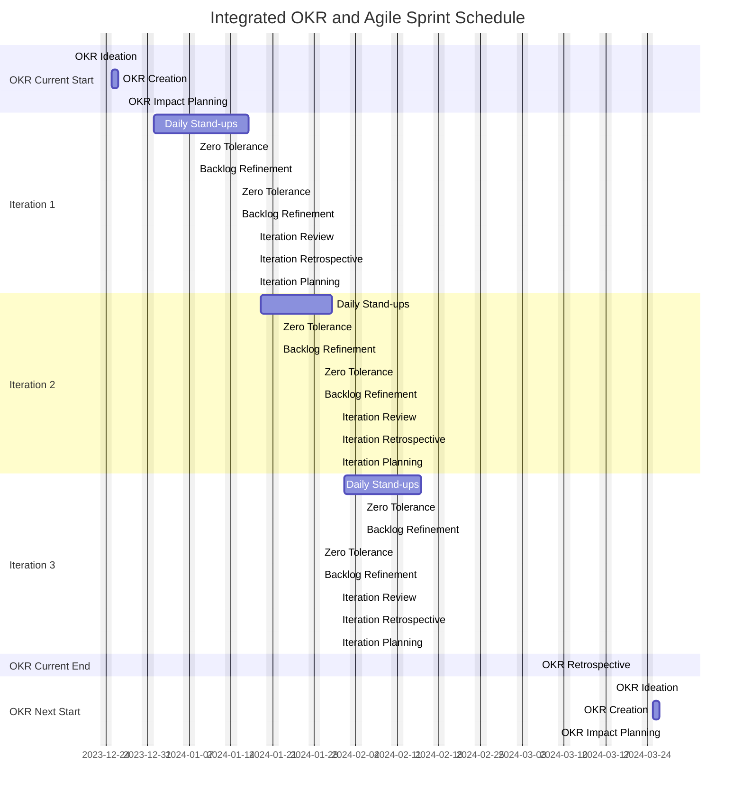

It's been nearly 2 years since I posted one of my [first blogs which was around OKRs (objectives and key results)](https://blog.hungovercoders.com/datagriff/2022/09/17/team-okr-hdd.html){:target="_blank"}. Since then I have been preaching their usage and loving the concept... but I have completely missed integrating their ideas into the day to day agile working practices, rendering them ineffective. Spurred on by co-workers, my will to ensure that prioritisation of value is easy during iteration ceremonies, and the awesome book [Succeeding with OKRs in Agile](https://www.amazon.co.uk/Succeeding-OKRs-Agile-deliver-objectives-ebook/dp/B0CGXLGL74){:target="_blank"}, below are my thoughts on how to integrate OKR cycles into the agile framework.

- [Why Integrate OKRs with Agile](#why-integrate-okrs-with-agile)
- [Making OKRs Everything...](#making-okrs-everything)
  - [Objective Zero](#objective-zero)
- [...Except Renumeration](#except-renumeration)
- [OKR and Agile Cycle](#okr-and-agile-cycle)
- [OKR Ceremonies](#okr-ceremonies)
  - [OKR Ideation](#okr-ideation)
    - [Categories of Concern](#categories-of-concern)
  - [OKR Creation](#okr-creation)
  - [OKR Impact Planning](#okr-impact-planning)
  - [OKR Retrospective](#okr-retrospective)
- [Iteration Ceremonies](#iteration-ceremonies)
  - [Daily Stand-ups](#daily-stand-ups)
  - [Backlog Refinement](#backlog-refinement)
  - [Iteration Review](#iteration-review)
  - [Iteration Planning](#iteration-planning)
  - [Zero Tolerance](#zero-tolerance)
- [Work Item Types and Tagging](#work-item-types-and-tagging)
  - [Work Item Types](#work-item-types)
  - [Work Item Tags](#work-item-tags)
    - [Value Tags](#value-tags)
    - [Concern Tags](#concern-tags)
    - [General Tags](#general-tags)
- [Stay Agile](#stay-agile)

## Why Integrate OKRs with Agile

If you do not integrate your OKRs with the day to day workload usually managed by agile processes like Kanban or Scrum, then your establishment of OKRs were simply a waste. The goal of OKRs is to drive bottom up engagement over top down control and therefore it should be in the very fabric of your teams day to day work. If you have not created that link between OKRs and the agile ceremonies that you maintain, then they will forever be treated as separate beasts where strategy and the execution of work items are not aligned. This creates the risk of losing the outcome orientated work established by OKRs in favour of ticket completion outputs favoured by short term iteration processes. By providing the alignment between the two you will be able to:

- Prioritise more easily during iteration ceremonies as you have taken the time to collectively establish prioritisation rules in advance
- Focus on outcomes over output by ensuring that the work you are doing is aligned with th pre-agreed OKRs
- Ensure bottom up engagement over top down control by allowing the team to establish their own OKRs and then align their work to them
- Create a self-motivating team that is focused on shared goals rather than individual performance

## Making OKRs Everything...

If you are going to do OKRs I recommend just using them for everything - except renumeration ([see below](#except-renumeration)). This is because one of the main purposes of OKRs is to make prioritisation easy when you are in the middle of your iterations. When you are in short-term work mode and deep into solving the problem that is immediately in front of you as part of your iterations, you are not taking the time to lookup as much you would like and prioritisation almost feels like a distraction. How many times you have yourself maybe groaned at the prospect of backlog refinement or iteration planning because you are in the middle of something and you just want to get it done? OKRs can help by making it far easier in these ceremonies to prioritise the work as a team as you have already spent the time in advance to establish and agree your OKRs. If something does not align with your OKRs then it is not a priority and you can move on. I'd recommend making no more than four objectives and aim for around three key results each. This provides a simple way for the team to focus by not overwhelming them with too much to remember.

**Objective 1**: Improve Whiskey Distillery Coverage

- **Key Result 1**: 100% of Scottish distilleries are available for online hungovercoder visitors to read by the end of the quarter.
- **Key Result 2**: 100% of Irish distilleries are available for online hungovercoder visitors to read by the end of the quarter.
- **Key Result 3**: 100% of Japanese distilleries are available for online hungovercoder visitors to read by the end of the quarter.
  
**Objective 2**: Improve Dog Rescue Coverage

- **Key Result 1**: 100% of Dogs Trust centres are available for online hungovercoder visitors to read by the end of the quarter.
- **Key Result 2**: 100% of Blue Cross centres are available for online hungovercoder visitors to read by the end of the quarter.
- **Key Result 3**: 25% of the ADCH rescues are available for online hungovercoder visitors to read by the end of the quarter.

**Objective 3**: Share Knowledge in Online Community

- **Key Result 1**: 2 Blog posts made available on hungovercoders by end of first month.
- **Key Result 2**: 4 Blog posts made available on hungovercoders by end of second month.
- **Key Result 3**: 6 Blog posts made available on hungovercoders by end of third month.

What about work that we need to do that does not come as part of the more strategic OKRs...?

### Objective Zero

What about "keeping the lights on" type work? This is where you can create an "Objective Zero" as discussed in the book [Succeeding with OKRs in Agile](https://www.amazon.co.uk/Succeeding-OKRs-Agile-deliver-objectives-ebook/dp/B0CGXLGL74){:target="_blank"}. This describes treating your objective zero and its key results as a set of service level agreements (SLAs) that you need to maintain in order to keep the lights on. This way you can still have a set of OKRs that are strategic and aspirational and a set of OKRs that are more operational and tactical. It also highlights the tension between the two types of work and the need to balance them rather than "managing" BAU tickets separately to what you want to achieve strategically. It may even involve removing a strategic objective because of the realisation of this work. 

**Objective Zero**: Ensure the team is able to maintain the current level of service

- **Key Result 1**: There are no critical software vulnerabilities by the end of the quarter.
- **Key Result 2**: There is a 99.95% uptime of our services by the end of the quarter.
- **Key Result 3**: There is no software with less than 3 months to end of life by the end of the quarter.

The fact that you will realise that you need an objective zero speaks volumes about its importance and I would potentially default to treating this objective as the most important when prioritising, but hopefully with the least amount of work. If you do find that your Objective Zero is consuming most of your strategic work, you likely need to revisit why as part of your OKR planning and bring in more focused objectives to solve the amount of time you need to spend on keeping the lights on. I love this idea to integrate this type of work as part of your OKRs and aim to satisfy the need to cover this work in the ceremony "[Zero Tolerance](#zero-tolerance)" below.

## ...Except Renumeration

The primary goal of every team member should simply be to help the team achieve their OKRs. However a persons individual renumeration should not be associated with the teams OKRs. This may sound counter-intuitive but as soon as you introduce individuals goals as being a driver for OKRs you will inevitably get gaming of the system ([Goldharts Law](https://en.wikipedia.org/wiki/Goodhart%27s_law#:~:text=Goodhart's%20law%20%5B...%5D,people%20start%20to%20game%20it.)) and so the very purpose of OKRs is lost. OKRs are meant to drive ownership and the enjoyment of solving a shared problem, if you start isolating the outcomes to individual performance of each team member you will lose the core aspect of a team contributing to a shared goal.

How then do you solve the problem of awarding people for their individual performance when so much of their day to day is wrapped up in the team OKRs? My approach would be to link self-development, team and community goals to the individuals performance. These three categories can be related to how they may impact OKRs but should not be directly linked to them. This way you can still reward people for their individual performance but not at the expense of the sharing of the team based goals that are the OKRs. Performance rewards here can not only be based on how they did against the tasks they set out for themselves, but also the tasks they chose and what foresight they held to know how they could help their own team or the wider communities. You could ask these questions to team members in order to spark ideas for their self-development, team and community goals:

- **What skills do you want to develop?** (how can you help the team as an individual)
  - I can learn automated testing (so that I can improve the quality and throughput of the team to meet their OKRs)  
- **What can you do to support the team?** (how can you help multiple individuals in the team)
  - I can automate that manual scaling process we have to do (so that I can save my team members time and give them more time to focus on OKRs)
- **What can you do to support the community?** (how can you help multiple teams)
  - I can demonstrate how we query our alerts to the wider community (so that other teams can also see more quickly observe their reliability metrics and improve their OKRs) 

## OKR and Agile Cycle

Below is an example schedule of how you can setup your ceremonies to align with your OKR cycles. The example below setups up quarterly OKR cycles and fortnightly iterations, this is a very high level view and you may need to adjust the timings of these ceremonies to fit your own teams needs. The OKR ceremonies are setup to align with the start and end of the OKR cycle and the iteration ceremonies are setup to align with the start and end of the iteration cycle. The iteration cycles are driven by the OKRs established and the iterations are then just that, iterative progress against your objectives inline with the key results by which they have agreed to be measured.

## OKR Ceremonies

### OKR Ideation

**Purpose:**: 

**Duration:**

**Agenda:**

#### Categories of Concern

The initial ideation process of OKRs could be quite an expansive place to find yourself in. You're going to need to be drowning in data as you make your decisions on what to focus on in the next OKR cycle otherwise you are just guessing. Below are a set of categories I suggest you walkthrough as part of your ideation ceremony to prioritise what you need to do next. If you do find you are unable to prioritise or simply guessing then I suggest first focussing on the "precision" concern below which should become a clear objective for the next OKR cycle.

|--|--|--|
| Category | Description | Examples |
|---|---|---|
| **Precision** | How easily can the team decide on which of the categories of concern we should focus on in the next OKR cycle. | Data availability for each of the below |
| **Deliverability** | How fast are we able to deliver changes. | Lead Time, Deploys to Production per Day, AB Tests Carried Out |
| **Performance** | How well are the products the team owns performing. | Conversion Ratios, Customer Satisfaction, Product Coverage |
| **Cost** | How much are we spending to provide our products. | Cloud Costs, Third Party Contract Costs |
| **Reliability** | How reliable are the teams products. | Uptime, Volume of alerts |
| **Risk** | How secure and compliant are the teams products. | Number of Critical Vulnerabilities, Number of Risk Events |
| **Developer Experience** | How happy are the team developing. | Team Happiness, Code Complexity, Skills Coverage |
| **Integration** | How well the team makes its products data available to other teams. | Speed of Onboarding, Amount of Duplicated Data, Other Teams Satisfaction |

### OKR Creation

**Purpose:**: 

**Duration:**

**Agenda:**

### OKR Impact Planning

**Purpose:**: 

**Duration:**

**Agenda:**

### OKR Retrospective

**Purpose:**: 

**Duration:**

**Agenda:**

## Iteration Ceremonies

**Purpose:**: 

**Duration:**

**Agenda:**

### Daily Stand-ups

**Purpose:**: 

**Duration:**

**Agenda:**

### Backlog Refinement

**Purpose:**: 

**Duration:**

**Agenda:**

### Iteration Review

**Purpose:**: 

**Duration:**

**Agenda:**

### Iteration Planning

**Purpose:**: 

**Duration:**

**Agenda:**

###  Zero Tolerance

**Purpose:**: 

**Duration:**

**Agenda:**

## Work Item Types and Tagging

### Work Item Types

### Work Item Tags

#### Value Tags

#### Concern Tags

#### General Tags

## Stay Agile

